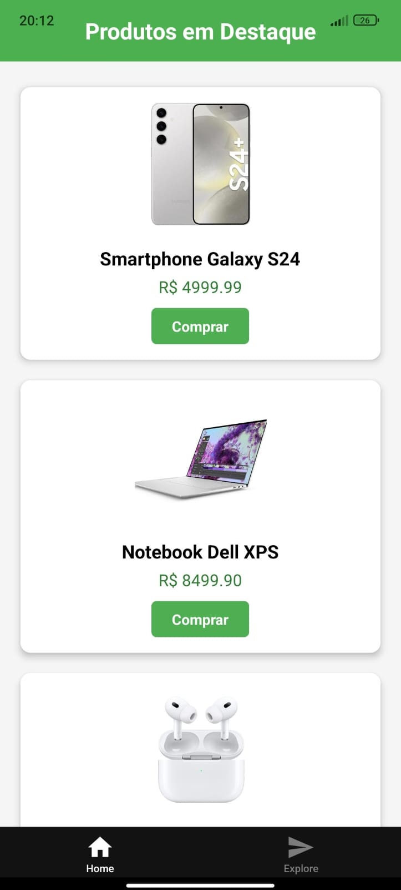

# ProdutosApp

Um aplicativo React Native com Expo que demonstra o uso de componentes reutilizáveis através de um cartão de produto (ProductCard).

## Capturas de Tela



## Descrição

Este projeto foi desenvolvido como parte de uma atividade para demonstrar o uso de componentes reutilizáveis em React Native. O aplicativo exibe uma lista de produtos usando um componente `ProductCard` que pode ser reutilizado em várias partes da interface.

## Funcionalidades

- Lista de produtos com imagem, nome e preço
- Cartões de produto com estilo personalizado (bordas arredondadas, sombra)
- Botão "Comprar" que exibe um modal de confirmação
- Design responsivo e amigável

## Estrutura do Projeto

```
/ProdutosApp
   /app
   index.tsx
  /components
    ProductCard.js
  package.json
  ... (outros arquivos do Expo)
```

## Como Rodar o Projeto

1. Clone o repositório
   ```bash
   git clone [https://github.com/MaximianoJ/Lista-de-Produtos.git]
   cd ProdutosApp
   ```

2. Instale as dependências
   ```bash
   npm install
   ```

3. Inicie o servidor de desenvolvimento
   ```bash
   npx expo start
   ```

4. Use o aplicativo Expo Go em seu dispositivo móvel para escanear o QR code ou use um emulador

## Requisitos Implementados

- ✅ Projeto criado com Expo CLI
- ✅ Componente ProductCard reutilizável
- ✅ Lista com 6 produtos
- ✅ Estilização com bordas arredondadas, sombra e layout centralizado
- ✅ Botão "Comprar" com modal de confirmação

## Tecnologias Utilizadas

- React Native
- Expo
- JavaScript

## Desenvolvido por

[Seu Nome]